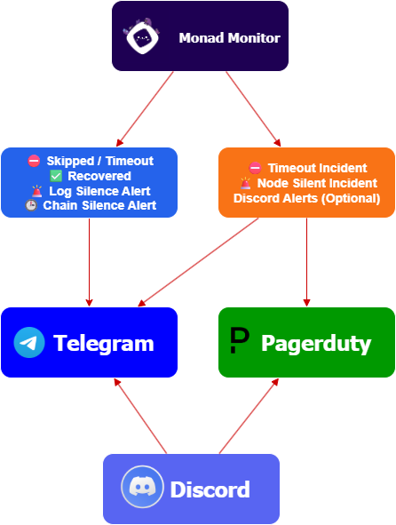

# ⨀ Monadoring Telegram Bot  


> Real-time skipped block & timeout monitoring for **Monad Testnet & Mainnet** validators.  
> Alerts via **Telegram**, optional **PagerDuty** integration, and optional **Discord → Telegram** bridge.

## 🛰️ Monad Monitor Bot Architecture 



---

## 📌 Features  
- ⏱ **Timeout / Skipped Block Detection**  
  - Detects missed rounds for your validator instantly  
  - Telegram alert **per timeout**  
  - PagerDuty triggers incident **only if threshold reached**  
- 🛑 **Ledger-tail Silence Detection**  
  - Alerts if `monad-ledger-tail` stops logging  
  - Detects chain halts or stuck rounds  
- 🧠 **Dedupe Engine**  
  - Prevents duplicate spam for the same round/type  
- 🛠 **Optional Integrations**  
  - **PagerDuty**: Incident escalation  
  - **Discord → Telegram**: Cross-channel notifications  
- 📊 **PM2 Integration**  
  - Auto-restarts, log management 

---

### 📡 Alert Scenarios & Notifications
- For **detailed examples** and **real alert logs**, see:  
[**logs.md → Alert Samples & Screenshots**](./docs/logs.md)

---

### 📌 Required 
- **Node.js & npm** → [📥 Download & Install (v20.x or higher recommended)](https://nodejs.org/en/download)
- **Telegram Bot** → [📄 Setup Guide](./docs/telegram.md) *(Token & Chat ID required)*  
- **Optional Discord** → [📄 Setup Guide](./docs/discord.md) *(Bot Token & Channel ID)*  
- **Optional PagerDuty** → [📄 Setup Guide](./docs/pagerduty.md) *(Events API Key integration)*

## 📦 Installation  

```bash
# Clone repository
git clone https://github.com/huginn-tech/monadoring-telegram-bot.git
cd monadoring-telegram-bot

# Install dependencies
npm install

# Create your .env file using the provided example:
cp .env.example .env
```

## ⚙️ Configuration .env Example
```bash
# === Validator settings (required) ===
# SECP public key of your validator (compressed hex)
MY_VALIDATOR_KEY=03fxxxxxxxxxxxxxxxxx

# === Telegram (required) ===
TELEGRAM_BOT_TOKEN=123456:ABC-DEF
TELEGRAM_CHAT_ID=-1001234567890

# === Thresholds & timers ===
# Telegram sends every timeout alert, PagerDuty triggers incident at threshold
TIMEOUT_THRESHOLD=5
# Deduplication window (ms)
DEDUPE_TTL_MS=120000
# Trigger Telegram alert if NO new blocks are proposed/finalized on the entire chain within X seconds.
CHAIN_SILENCE_SEC=300
# Ledger-tail log silence detection
LOG_SILENCE_TG_SEC=60
LOG_SILENCE_PD_SEC=300


# === PagerDuty (optional) ===
# Events API routing key; leave empty to disable PD
PAGERDUTY_ROUTING_KEY=
PAGERDUTY_EVENTS_URL=

# === Discord bridge (optional) ===
DISCORD_TOKEN=
DISCORD_CHANNEL_ID=
# Set to true to send all Discord messages to PagerDuty, otherwise false
PD_ON_DISCORD=false

```
⚠️ Important
MY_VALIDATOR_KEY is required — the bot exits if missing.
If PAGERDUTY_ROUTING_KEY is set but PAGERDUTY_EVENTS_URL is missing, the bot will not start

## 🚀 Start the bot
```bash
# Start the bot manually
npm start
```

### or Install PM2 globally (recommended)
```bash
npm install -g pm2
pm2 start npm --name monad-monitor -- start

# Show logs
pm2 logs monad-monitor

# Restart the bot
pm2 restart monad-monitor

# Stop the bot
pm2 stop monad-monitor

# Enable auto-start on reboot (optional)
pm2 startup
pm2 save
```
### If everything is set up correctly, the logs and Telegram bot will look like this:


---
If you encounter any issues or need assistance, feel free to reach out:
- **Telegram:** [@sourled](https://t.me/sourled)
- **Discord:** gokay5690
